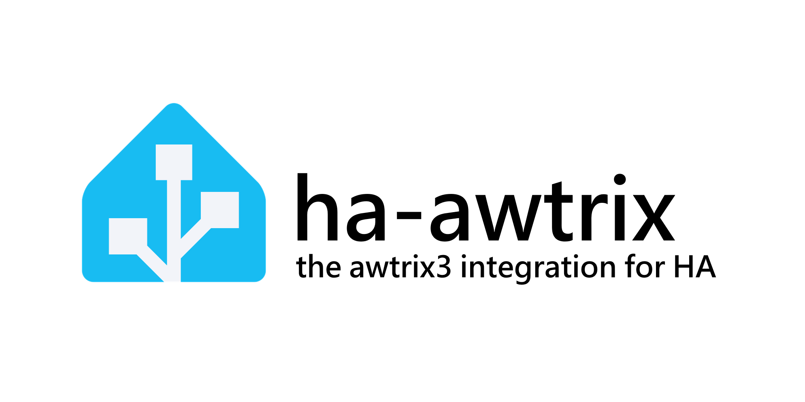

# AWTRIX for Home Assistant



Custom integration for [AWTRIX 3](https://blueforcer.github.io/awtrix3/) LED matrix displays. Controls your device locally via HTTP polling — no cloud required.

> **Who is this for?** AWTRIX 3 supports both HTTP and MQTT. This integration targets users who prefer a simple setup without running an MQTT broker. If you already use MQTT in your Home Assistant installation, the [official MQTT integration](https://www.home-assistant.io/integrations/mqtt) may offer more flexibility.

## Features

- **Light entity** — turn the matrix on/off and control brightness
- **Reboot button** — restart the device from HA
- **Sensors** — apps count (with full list as attribute), current app, battery level, WiFi signal strength
- **5 services** — send notifications, dismiss them, create/update custom apps, delete apps, switch to a specific app
- **Multi-device** — add as many AWTRIX devices as you want, each as a separate config entry

## Installation

### HACS (recommended)

1. In HACS, go to **Integrations** → three-dot menu → **Custom repositories**
2. Add `https://github.com/juliensere/ha-awtrix` with category **Integration**
3. Install **AWTRIX** and restart Home Assistant

### Manual

1. Download the [latest release ZIP](https://github.com/juliensere/ha-awtrix/releases/latest)
2. Extract and copy `custom_components/awtrix/` into your `<config>/custom_components/` folder
3. Restart Home Assistant

## Configuration

1. Go to **Settings → Devices & Services → Add Integration**
2. Search for **AWTRIX**
3. Enter the IP address of your AWTRIX device

Repeat for each device.

## Entities

| Entity | Type | Description |
|--------|------|-------------|
| `light.<name>` | Light | Matrix power + brightness (0–255) |
| `button.<name>_reboot` | Button | Reboot the device |
| `sensor.<name>_apps` | Sensor | Number of apps in rotation; `apps` attribute lists all names |
| `sensor.<name>_current_app` | Sensor | Name of the currently displayed app |
| `sensor.<name>_battery` | Sensor | Battery level (%) |
| `sensor.<name>_wifi_signal` | Sensor | WiFi RSSI (dBm) — diagnostic |

## Services

All services accept a `device_id` to target any registered AWTRIX device.

### `awtrix.notify`

Display a one-shot notification.

| Field | Required | Description |
|-------|----------|-------------|
| `device_id` | yes | Target device |
| `text` | | Message text |
| `icon` | | Icon ID, filename, or base64 8×8 JPEG |
| `color` | | Text color as `RRGGBB` hex |
| `duration` | | Display duration in seconds (1–300) |
| `hold` | | Freeze display until dismissed (`true`/`false`) |
| `progress` | | Progress bar value 0–100 |
| `bar` | | Bar chart — array of up to 16 values |

### `awtrix.dismiss`

Dismiss the current hold notification.

| Field | Required | Description |
|-------|----------|-------------|
| `device_id` | yes | Target device |

### `awtrix.set_app`

Create or update a custom app.

| Field | Required | Description |
|-------|----------|-------------|
| `device_id` | yes | Target device |
| `name` | yes | App identifier |
| `text` | | Display text |
| `icon` | | Icon ID, filename, or base64 8×8 JPEG |
| `color` | | Text color as `RRGGBB` hex |
| `duration` | | Slot duration in seconds |
| `lifetime` | | Auto-remove if not refreshed within N seconds (0 = never) |
| `save` | | Persist across reboot — avoid for high-frequency updates |
| `progress` | | Progress bar value 0–100 |
| `bar` | | Bar chart — array of up to 16 values |

### `awtrix.delete_app`

Remove a custom app.

| Field | Required | Description |
|-------|----------|-------------|
| `device_id` | yes | Target device |
| `name` | yes | App name to delete |

### `awtrix.switch_app`

Immediately jump to a specific app.

| Field | Required | Description |
|-------|----------|-------------|
| `device_id` | yes | Target device |
| `name` | yes | App name to display |

## Development

```bash
# Start a local HA instance with the integration mounted
docker compose up

# Run tests
pip install -r requirements-dev.txt
pytest
```

HA will be available at http://localhost:8123.
